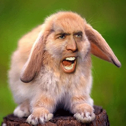
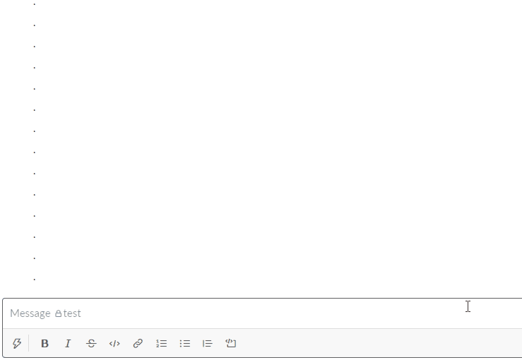
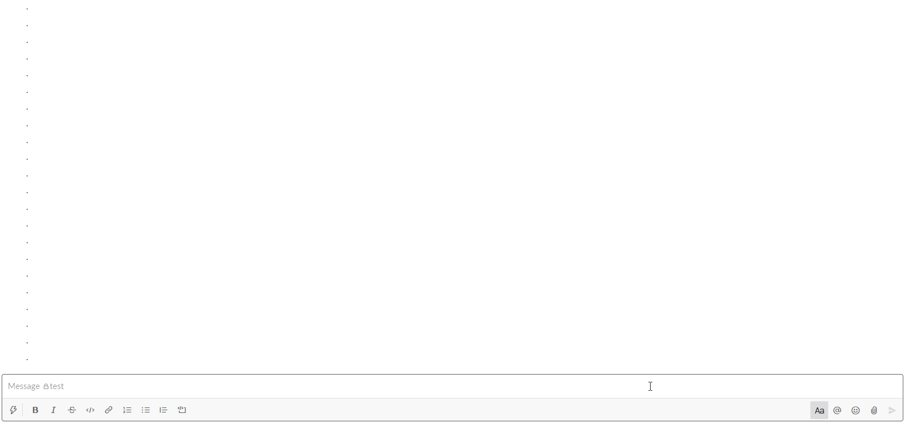
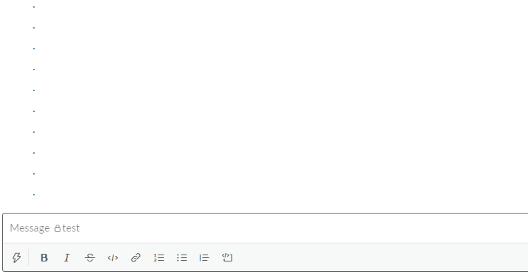
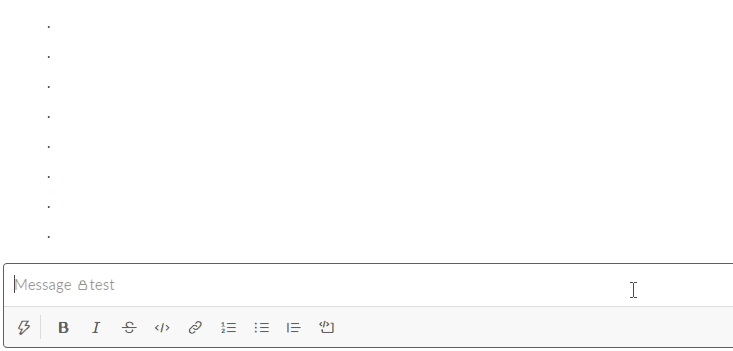
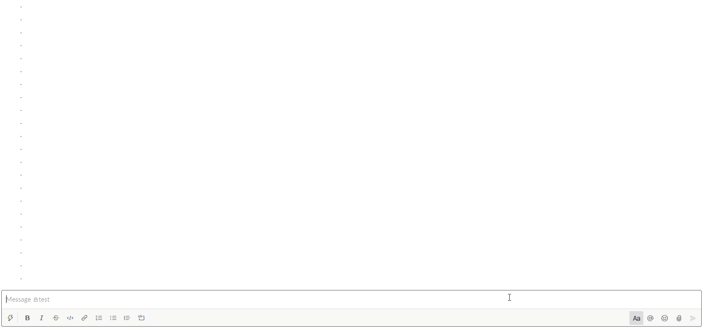

# KarrotAwards


### Table of contents
- [Overview](#overview)
- [Functions](#functions)
- [Components and Limitations](#components-and-limitations)
- [Setup](#setup)
- [Code Structure](#code-structure)
- [Observations and Lessons Learned](#observations-and-lessons-learned)
- [Future Improvements](#future-improvements)

### Overview
At my workplace we use Slack for communication and we used differnt types of Karma bots and apps before. However, we eventually got rid of all of them. Then one day instead of just giving karma we started giving each other different emojis like ,  and . One person would keep track of all awards that people got in a Word document. So I decided to create Slack application specifically for purpose of giving different emoji awards to people and keep track of those. I came up with the name __KarrotAwards__ - a combination of Karma + Carrot :laughing: - and this is how this fun application has started! :laughing:

### Functions
The application is a global Slack command that is available to any User in any channel, except threads. 

The application has 4 main functions: 
- ```Help``` -> this will send private message to the User who called it. The message will explain all available functions and what they do. To use it User need to type __/karrotawards help__.



- ```Assign award``` -> This is a main data entry point for the application and once called it will generate a new modal window to collect data from the User about who they are giving the awards to, which awards they are willing to assign, and also a message text. For all 3 fields there is validation. After the User inputs the data and clicks submit button, the application will announce the event in the channel with a randomly selected message from predefined set of funny messages stored in the backend. To invoke the command User needs to type __/karrotawards__ and hit enter. Each award has its own score that will contribute to the total User's score.



- ```Leaderboard``` -> This commands allows User to see how many different awards top X Users have. Once the command is executed the application will generate an HTML table image in the backend and send it back to the channel. The command for this is __/karrotawards leaderboard__. It has a default top X value, but it is also possible to specify a number that User wants (up to a specific max number). To do that User could do __/karrotawards leaderboard 12__ for example, which would give top 12 Users as a result.



- ```Scorecard``` -> This is a special case for the leaderboard command. To avoid having to always spam leaderboard to the channel, or in case the User didn't have enough points to be included in the leaderboard top X, I've added an ability to view a scorecard for one specific User - which would be sent as a private message.



All the above functions also take into consideration invalid user inputs and try to explain what went wrong and where to seek help.



### Components and limitations
This is a [NodeJS](https://nodejs.org/) application, coded using [Slack Bolt SDK](https://slack.dev/bolt-js/tutorial/getting-started).
It is setup as [Slack](https://slack.com/) application. In the backend the data is stored in [MongoDB](https://www.mongodb.com/cloud/atlas) and [uDrop](https://www.udrop.com/) service is used to host generated images. The code is setup to be deployed to [Heroku](https://www.heroku.com) platform.

The application is making use of [Got](https://github.com/sindresorhus/got) and [Node HTML to Image](https://github.com/frinyvonnick/node-html-to-image) packages to make API requests and generate images from HTML.

Since in this application need to have actual emoji images to generate HTML table, the limitation of the application is that we need to add __KarrotAwards__ custom emojis to be able to generate leaderboard and scorecards.

Another limitation is that it looks like as of January 16, 2021 Slack commands are not supported in Slack Threads, so this application will not work there.

### Setup


### Code structure
### Observations and lessons learned
On the first week of release of this application to my organization Slack, 32 new Users started using the app in addition to previous 25 Users who were participating and keeping the score in a Word document! :laughing:

### Future improvements
// TODO: Use OpenAI API GPT3 to generate messages instead of having them in the DB. Or maybe even mix both? Need to do some research. https://beta.openai.com/ 
// TODO: For leaderboard also have different random messages like we have for the award announcements.
// TODO: Instead of using uDrop service to host images, better option would be Amazon S3? https://devcenter.heroku.com/articles/s3-upload-node
