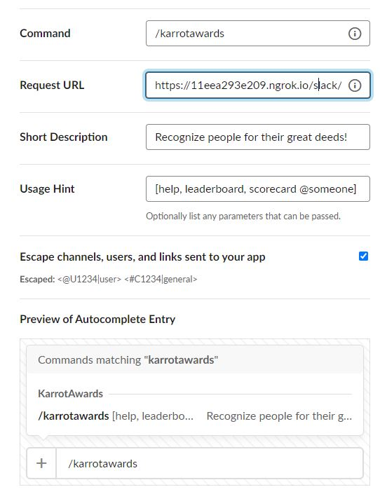
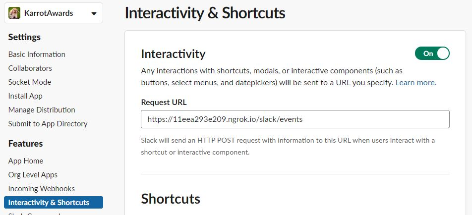
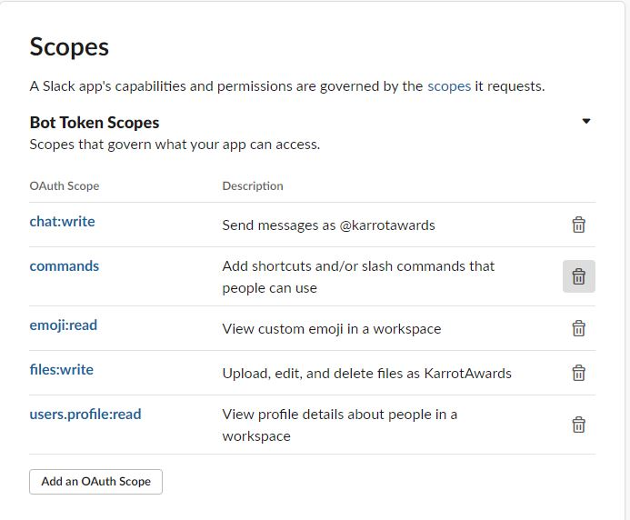
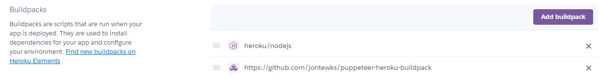

# KarrotAwards


### Table of contents
- [Overview](#overview)
- [Functions](#functions)
- [Components and Limitations](#components-and-limitations)
- [Setup and Testing](#setup-and-testing)
- [Code Structure](#code-structure)
- [Observations and Lessons Learned](#observations-and-lessons-learned)
- [Future Improvements](#future-improvements)

### Overview
At my workplace we use Slack for communication and we used differnt types of Karma bots and apps before. However, we eventually got rid of all of them. Then one day instead of just giving karma we started giving each other different emojis like ,  and . One person would keep track of all awards that people got in a Word document. So I decided to create Slack application specifically for purpose of giving different emoji awards to people and keep track of those. I came up with the name __KarrotAwards__ - a combination of Karma + Carrot :laughing: - and this is how this fun application has started! :laughing:

### Functions
The application is a global Slack command that is available to any User in any channel, except threads. 

The application has 4 main functions: 
- ```Help``` -> this will send private message to the User who called it. The message will explain all available functions and what they do. To use it User need to type __/karrotawards help__.


- ```Assign award``` -> This is a main data entry point for the application and once called it will generate a new modal window to collect data from the User about who they are giving the awards to, which awards they are willing to assign, and also a message text. For all 3 fields there is validation. After the User inputs the data and clicks submit button, the application will announce the event in the channel with a randomly selected message from predefined set of funny messages stored in the backend. To invoke the command User needs to type __/karrotawards__ and hit enter. Each award has its own score that will contribute to the total User's score.


- ```Leaderboard``` -> This commands allows User to see how many different awards top X Users have. Once the command is executed the application will generate an HTML table image in the backend and send it back to the channel. The command for this is __/karrotawards leaderboard__. It has a default top X value, but it is also possible to specify a number that User wants (up to a specific max number). To do that User could do __/karrotawards leaderboard 12__ for example, which would give top 12 Users as a result.


- ```Scorecard``` -> This is a special case for the leaderboard command. To avoid having to always spam leaderboard to the channel, or in case the User didn't have enough points to be included in the leaderboard top X, I've added an ability to view a scorecard for one specific User - which would be sent as a private message.


All the above functions also take into consideration invalid user inputs and try to explain what went wrong and where to seek help.


### Components and limitations
This is a [NodeJS](https://nodejs.org/) application, coded using [Slack Bolt SDK](https://slack.dev/bolt-js/tutorial/getting-started).
It is setup as [Slack](https://slack.com/) application. In the backend the data is stored in [MongoDB](https://www.mongodb.com/cloud/atlas) and [uDrop](https://www.udrop.com/) service is used to host generated images. The code is setup to be deployed to [Heroku](https://www.heroku.com) platform. 

The application is making use of [Got](https://github.com/sindresorhus/got) and [Node HTML to Image](https://github.com/frinyvonnick/node-html-to-image) packages to make API requests and generate images from HTML.

Although not actively used in the code as an API to produce and send messages back, half of the messages that are referenced in the [message templates](./app_setup_files/message_templates_collection.json) were generated (with very minor tweaks) by using [OpenAI API Beta](https://openai.com/) playground portal. I've got access to the open beta halfway through working on this project and was very impressed with the results that I was able to produce!

Since in this application we need to have actual emoji images to generate HTML table, the limitation of the application is that we need to add __KarrotAwards__ custom emojis to Slack workspace to be able to generate leaderboard and scorecards.

Another limitation is that it looks like as of January 16, 2021 Slack commands are not supported in Slack Threads, so this application will not work there.

### Setup and testing
First, Slack App needs to be configured and setup with __Slash Command__ endpoint:



Also the app needs __Interactivity & Shortcuts__ endpoint:



The app needs bot scopes as follows:



The above URLs have been setup fot the DEV testing and the endpoints URL main domain is generated by [Ngrok](https://ngrok.com/). Later it could be changed to what we get from [Heroku](https://www.heroku.com) by deploying to Staging/Production environment.

After that the app needs to be added to Slack workspace and the emojis listed in [awards images](./app_setup_files/awards_images) need to be added (as an example, could be really anything else, even gif emojis) to Slack as custom emojis (with the same name as file names).

To setup the backend MongoDB an account need to be created at [MongoDB](https://www.mongodb.com/cloud/atlas). The DB needs to be created with the following collections: __ScoreCards__, __Awards__, __MessageTemplates__. In __Awards__ collection insert the following [data](./app_setup_files/awards_collection.json) (as an example, could be really anything according to the desired setup). Similarly, to the __MessageTemplates__ we need to add the following [data](./app_setup_files/message_templates_collection.json). The __Awards__ data is tied to the custom Slack emojis added earlier by the emoji name, as in __:karrotawards_emoji:__.

An account needs to be created to be able to upload and host images on [uDrop](https://www.udrop.com/).

To go from DEV testing to Staging/Prodiuction the application can be deployed to [Heroku](https://www.heroku.com) platform. Staging environment can be any personally created Slack workspace, while Production would be considered an organization's workspace. __Note__: when setting the project in Heroku the following buildpacks need to be installed:



Also for optimal experience Heroku should be setup with __Hobby__ dyno type at minimum (free dyno goes to sleep which breaks the app, because Slack gives only 3 seconds to generate the modal on received command, and Heroku dynos cannot restart that quick).

All required ENV variables are listed in [this](./.env.template) file and here is the short explanation as to what they are:

- ```PORT``` -> port on which app will listen, for DEV doesn't really matter, for Heroku has to be __8000__
- ```SLACK_SIGNING_SECRET``` -> signing secret that you get when setting up Slack app
- ```SLACK_BOT_TOKEN``` -> Slack app bot token that you get by adding app to the workspace, typically should have format of __xoxb-...__
- ```MONGODB_USER_NAME``` -> user name for MongoDB
- ```MONGODB_USER_PASSWORD``` -> user password for MongoDB
- ```MONGODB_CLUSTER_URL``` -> MongoDB cluster URL
- ```MONGODB_NAME``` -> name of your MongoDB where you have Awards, MessageTemplates and ScoreCards collections
- ```MAX_NUMBER_OF_SELECTED_USERS``` -> controls how many users can be selected in the app modal for awards
- ```MAX_NUMBER_OF_SELECTED_AWARDS``` -> controls how many different awards can be given at once
- ```AWARD_MESSAGE_MAX_CHARACTER_NUMBER``` -> controls max length of the award message that user is allowed to type in the modal
- ```LEADERBOARD_DEFAULT_NUMBER_OF_USERS``` -> default number of users to show in the __/karrotawards leaderboard__ command
- ```LEADERBOARD_MAX_NUMBER_OF_USERS``` -> maximum allowed number of users to be shown in the __/karrotawards leaderboard x__ command
- ```UDROP_KEY1``` -> uDrop requires two keys to authenticate API, so this is one of them
- ```UDROP_KEY2``` -> uDrop requires two keys to authenticate API, so this is one of them
- ```CONTRIBUTE_EMAIL_ADDR``` -> in __/karrotawards help__ command there is a message at the bottom with contact email. This is different between different environments, so I made it configurable
- ```WORK_NOTIFICATION_TIMEOUT_INTERVAL_MILLISECONDS``` -> controls how long each command should execute before sending generic "work in progress" to the user. This is needed to show user that something is happening for long running operations (such as image generation and upload), but do not show it for typically fast operations (such as modal opening), which sometimes can stil ltake long enough time, so that in this case the "work in progress" will be shown as well

### Code structure
The main code file is [app.js](./app.js) in which most of the work happens. The main user entry points are:
- ```app.command('/karrotawards', async ({ ack, body, respond, client }) => { ...``` -> listener for any __/karrotawards__ command payload
- ```app.view({ callback_id: 'karrotawards_modal_callback_id', type: 'view_submission' }, async ({ ack, body, view }) => { ...``` -> listener for awards modals submissions
- ```app.view({ callback_id: 'karrotawards_modal_callback_id', type: 'view_closed' }, async ({ ack, body, view }) => { ...``` -> listener for awards modals closing, needed mostly for user interaction and behaviour analysis and logging

Everything else is separate block functions that support the above entry points.
Additionally, there are helpers related to [HTML functionality](./helpers/htmlTable.js) (generation) and [modal](./helpers/modal.js) (generation, validation, data extraction) functionality.

### Observations and lessons learned
On the first week of release of this application to my organization Slack, 32 new Users started using the app in addition to previous 25 Users who were participating and keeping the score in a Word document! :laughing: I even did a presentation about this project in a monthly digital townhall!

As for lessons learned - this whole project was a really amazing experience for me, since everything that has been done here I've never used before! Slack API, Bolt SDK, NodeJS, MongoDB, uDrop, Ngrok, Heroku, Got, NodeHTMLToImage, OpenAI GPT-3 Beta API - all these things I've done research on and put together as I was learning about them - was a one big exciting journey that helped to bring my vision to life and share it with others while having quite a lot of fun! :blush:

### Future improvements
One improvement that I would really like to explore with this project is actual production use of [OpenAI API](https://openai.com/) and their GPT-3 engine to fully generate on the fly the award announcement messages. This could also be used for leaderboard announcements. For that I would need to experiment more with the API and GPT-3 engine to make sure it produces the results that are adequate to my use case. After that I would need to present my project to OpenAI team for approval.